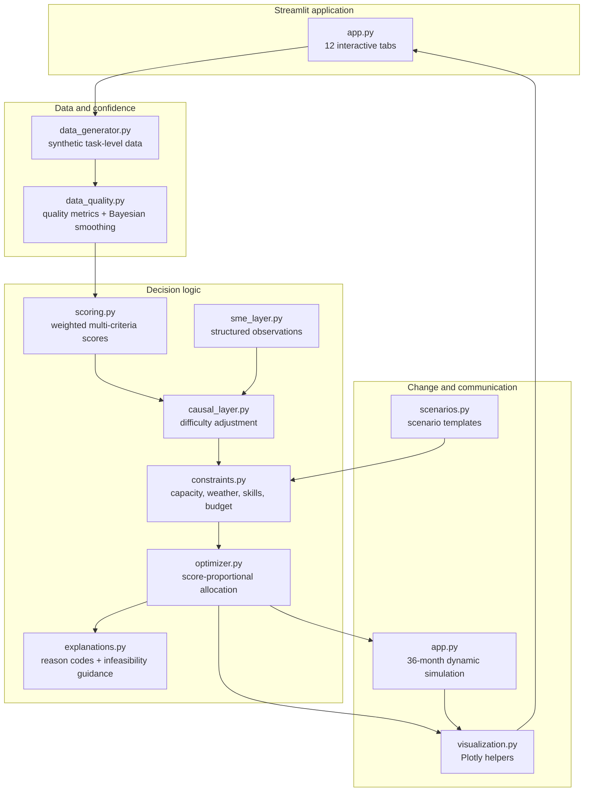
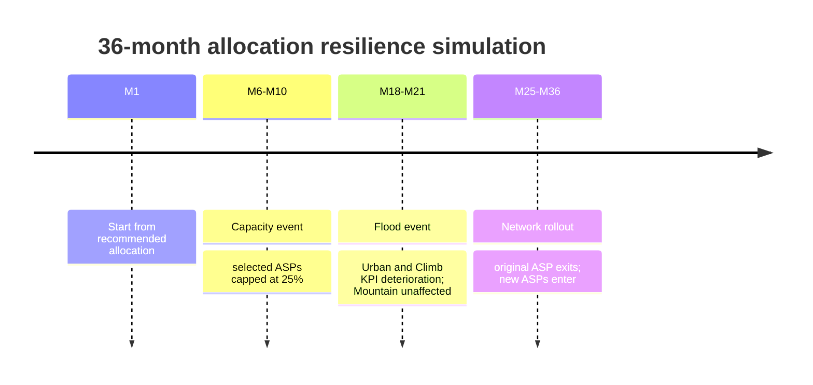

# Dynamic ASP Allocation Optimizer

[](https://www.python.org/)
[](https://streamlit.io/)
[](https://plotly.com/python/)
[](https://pytest.org/)

A decision-intelligence demonstration for allocating telco field-service work across Authorized Service Providers (ASPs).

The application moves beyond reporting historical performance. It combines imperfect operational data, business priorities, causal context, subject-matter expertise, operational constraints, and scenario analysis to recommend **what to do next**.

> This repository is a synthetic-data demonstration. It is designed to explain prescriptive analytics capabilities, not to represent a production allocation platform or real customer data.

## What the demo answers

Given uncertain demand, competing objectives, uneven ASP performance, and hard operational limits:

* Which ASP should receive more or less work?
* How should cost, safety, SLA, NPS, and repeat visits be balanced?
* Are poor KPIs caused by poor performance—or by harder assignments?
* Is the recommended allocation feasible under capacity, weather, certification, budget, and share constraints?
* How should the allocation adapt when demand, weather, budgets, or the ASP landscape changes?

## Start the application

### Requirements

* Python 3.11 or newer
* pip
* A browser

### Local setup

```bash
git clone https://github.com/SMusial/Prescriptive_ASP.git
cd Prescriptive_ASP

python -m venv .venv
# Windows PowerShell
.\.venv\Scripts\Activate.ps1
# macOS / Linux
# source .venv/bin/activate

pip install -r requirements.txt
streamlit run app.py
```

The dependency set includes Streamlit, Pandas, NumPy, Plotly, SciPy, PuLP, PyYAML, and Pytest.

## Guided demo flow

Use the tabs from left to right. Each stage writes to Streamlit session state and feeds the next decision stage.


### Suggested first run

1. Open **Setup**.
2. Keep the default seed `42`, historical volume `1,780`, four historical weeks, and four planning weeks.
3. Click **Generate Synthetic Data**.
4. Open **Data Confidence** and show the quality-improvement views.
5. In **Business Priorities**, keep the default weights: Cost 20%, Safety 30%, SLA 25%, NPS 15%, Repeat Visits 10%.
6. Click **Update Scores & Rankings**.
7. Use **Causal Intelligence** to compare raw and adjusted Mountain scores.
8. Apply the default constraints.
9. Generate the recommended split and compare it with an equal allocation.
10. Start the 36-month rebalancing simulation.
11. Explore Budget Reduction, Demand Increase, and 4G → 5G Network Swap scenarios.

## Decision-intelligence architecture



## The analytics pipeline

### 1. Synthetic operational data

`src/data_generator.py` creates deterministic task-level data for three service profiles:

| Profile | ASPs | Primary challenge |
|---|---|---|
| Urban | CityConnect, UrbanLink, StreetNet | Volume, cost, SLA |
| Mountain | AlpineReach, SummitField, AlpinGmbH | Travel, access, weather |
| Climb | SkyClimb, TowerPro, VerticalWorks | Safety, certification, risk |

Generated records include task complexity, travel distance, weather, access difficulty, certification availability, emergency status, cost, SLA outcome, repeat visits, NPS, and safety incidents. Missing NPS and confidence values are intentionally introduced so the confidence layer can demonstrate how decisions remain usable with imperfect data.

### 2. Data confidence

`src/data_quality.py` performs two complementary activities:

* Quality assessment: missingness, sample adequacy, outlier counts, safety sparsity, and an overall confidence label.
* Stabilization: 5th–95th percentile winsorization followed by empirical-Bayes shrinkage toward the profile baseline.

The smoothing pattern is:

```text
smoothed KPI = (observed KPI × observations + baseline KPI × prior strength)
                / (observations + prior strength)
```

This reduces overreaction to small samples, missing responses, and extreme values without replacing missing NPS with zero.

### 3. Business-priority scoring

`src/scoring.py` normalizes KPI values across the ASP population to a 0–100 scale and computes a weighted business score:

```text
Business score = Cost score × cost weight
              + Safety score × safety weight
              + SLA score × SLA weight
              + NPS score × NPS weight
              + Repeat-visit score × repeat-visit weight
```

Cost and repeat visits are inverse metrics: lower is better. The interactive sliders must total 100% before scores are recalculated.

### 4. Causal intelligence and SME context

Raw performance can be misleading when ASPs receive systematically different work. The Mountain analysis adjusts scores using relative task difficulty:

```text
Adjustment = 18 × (complexity ratio − 1)
           +  8 × (travel ratio − 1)
           +  6 × (weather ratio − 1)
           +  6 × (access ratio − 1)
```

Structured SME observations then add context that is not directly visible in the generated KPIs—for example emergency expertise, a quality cap above 45% allocation, or a region-specific weather penalty.


### 5. Constraint-aware allocation

`src/constraints.py` and `src/optimizer.py` turn scores into an allocation that must respect the operating envelope:

* Minimum and maximum ASP share
* ASP capacity scaled by planning period
* Weather-related capacity reduction
* Safety and certification eligibility for Climb work
* Workforce mix requirements
* Maximum rework rate
* Budget
* SME-specific share caps

The allocator starts with score-proportional task volumes, applies a winner/runner-up bonus, clips to constraints, and reconciles the result back to demand. If the operating envelope is infeasible, the app reports the unmet demand or budget overrun instead of hiding the trade-off.

### 6. Dynamic rebalancing

The application simulates 36 months from the recommended allocation. The policy limits movement to 5 percentage points per month and demonstrates three changes in the operating environment:



### 7. Scenarios

The scenario interface tests resilience under three families of change:

| Scenario | Levels | Decision question |
|---|---|---|
| Budget Reduction | −5%, −15%, −25% | How far can cost be reduced without breaking performance? |
| Demand Increase | +10%, +20%, +40% | Where do capacity bottlenecks appear first? |
| 4G → 5G Network Swap | Conservative, Expected, Accelerated | How does technology transformation change the ASP portfolio? |

Each scenario compares allocation and cost with the baseline, reports feasibility, shows trade-offs, calculates a resilience score, and proposes actions.

## Repository structure

```text
Prescriptive_ASP/
├── app.py                         # Streamlit UI and end-to-end demo orchestration
├── config/
│   ├── default_settings.yaml      # Default weights, capacities, and constraints
│   └── scenario_templates.yaml    # Reusable what-if templates
├── src/
│   ├── causal_layer.py            # Difficulty ratios and causal/SME score adjustments
│   ├── constraints.py             # Constraint assembly and eligibility checks
│   ├── data_generator.py          # Deterministic synthetic task and workforce data
│   ├── data_quality.py            # Quality assessment and empirical-Bayes smoothing
│   ├── explanations.py            # Allocation reason codes and infeasibility suggestions
│   ├── optimizer.py               # Score-based constrained allocator
│   ├── scenarios.py               # Scenario-template loading and rebalancing interface
│   ├── scoring.py                 # KPI normalization and weighted business scores
│   ├── sme_layer.py               # Time-bounded SME observations
│   └── visualization.py           # Plotly allocation, radar, and KPI helpers
├── tests/
│   └── test_demo.py               # Generator, smoothing, scoring, constraints, and scenario tests
├── CURRENT_STATE.md               # Detailed current behavior and demo notes
├── DEMO_TYPESCRIPT.md             # 45-minute presentation script
├── PROJECT_SPECIFICATION.md       # Architecture and capability specification
├── requirements.txt
└── .gitignore
```

## Configuration

The main settings are stored in `config/default_settings.yaml`. Scenario templates live in `config/scenario_templates.yaml` and include examples for balanced operation, cost pressure, SLA recovery, bad Mountain weather, certification issues, and next-month rebalancing.

For repeatable demonstrations, use a fixed seed. The repository documentation recommends seed `42` for the standard walkthrough and seed `1780` for a stronger Mountain causal-ranking change.

## Tests

Run the automated tests with:

```bash
pytest -q
```

The test suite covers:

* Required generated columns and intentional missing values
* Smoothing output bounds
* Business-score bounds
* Climb ineligibility behavior
* Budget infeasibility signaling
* SME share-cap behavior
* Sensitivity of scores to changed priorities

## Demo scope versus production scope

This project intentionally uses transparent, lightweight methods so the decision journey is easy to explain:

| Capability | Demonstrated here | Production direction |
|---|---|---|
| Decision value | Weighted KPI scoring | MCDA, utility models, Bayesian decision networks |
| Data reliability | Winsorization and empirical-Bayes smoothing | Hierarchical Bayesian models and calibration |
| Causal context | Difficulty ratios and SME deltas | DAGs, propensity methods, causal forests, counterfactual analysis |
| Optimization | Score-proportional allocation with clipping | LP/MIP, robust or stochastic optimization |
| Adaptation | Seeded monthly simulation with movement caps | Rolling-horizon optimization, contextual bandits, MPC |
| Scenarios | Deterministic what-if re-optimization | Monte Carlo, digital twins, stochastic programming |
| Explanation | Template-based reason codes | Audit-ready causal and counterfactual explanations |
| Governance | Conceptual thresholds and hard gates | Policy-as-code, approvals, audit logs, model-risk controls |

Do not interpret the generated results as operational recommendations. A production implementation would require validated source data, calibrated models, explicit decision rights, monitoring, security controls, and human approval for safety-critical decisions.

## Related documentation

* [Project specification](PROJECT_SPECIFICATION.md) — architecture, data model, algorithms, constraints, and technology stack.
* [Current state](CURRENT_STATE.md) — detailed tab behavior, design decisions, ASP templates, and demo tips.
* [Demo script](DEMO.md) — suggested 45-minute narrative for business and technical audiences.

## License

This project is licensed under the Apache License 2.0. See the [LICENSE](LICENSE) file for details.
